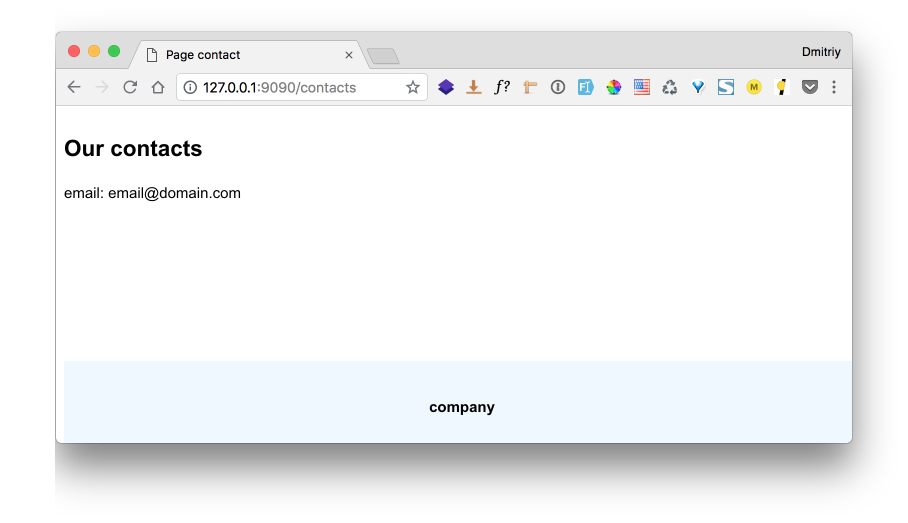

skeletonWSGI
===
[](https://travis-ci.org/mitrofun/skeletonWSGI) [](https://coveralls.io/github/mitrofun/skeletonWSGI) [](https://scrutinizer-ci.com/g/mitrofun/skeletonWSGI/?branch=master)  

Simple skeleton uWSGI compatible web application

Installation
=====
    git clone https://github.com/mitrofun/skeletonWSGI.git nameYourProjectDir

Custom example page
====
    
after move in nameYourProjectDir

    cd nameYourProjectDir

for creating custom template and views, for example uncomment code in `views.py` and `setting.py` 

Run project
=====

    make run 
or run command

    uwsgi --http :9090 --touch-reload settings.py --touch-reload views.py --touch-reload templates/* --wsgi-file start.py --honour-stdin --check-static .
    
open page `http://localhost:9090` in browser


Use
====
Let's consider the example of creating a new page, like this



Views
---
In `view.py` add function
```python
from core.context import render_content_by_view_name

def contacts(view_name, environ):
    context = {
        'title': 'Page contact',
        'page_header': 'Our contacts',
        'email': 'email@domain.com'
    }

return render_content_by_view_name(view_name, environ, context)
```

Route
---
In `settings.py` add route for new page.
**Important**: *the value in the directory should be called as the function in view.*
```python
route = {
    '/contacts' : 'contacts'
}
```
Template
---
Next, create a template for the new page in folder templates, example: contacts.html
```html
<!DOCTYPE html>
<html lang="en">
<head>
  <meta charset="UTF-8">
  <title>{{ title }}</title>
  <meta http-equiv="X-UA-Compatible" content="IE=edge">
  <meta name="viewport" content="width=1100">
  <link rel="stylesheet" href="/static/custom.css">
</head>
<body>
  <div class="wrapper">
    <div class="content">
      <section class="main">
          <h1>{{ page_header }}</h1>
          <div class="main__text">
            email: {{ email }}
          </div>
      </section>
    </div>
  </div>
  <footer class="footer">
    <div class="footer__text">company</div>
  </footer>
</body>
</html>
```

and add template path to `settings.py` in dict templates
**Important**: *the key in the directory should be called as the function in view.*
```python
templates = {
    'contacts': 'templates/contacts.html'
}
```

Variables in template
---
You can use variables in the template.To do this, the name of the variables is framed in `{{ var_name }}` and their values are added to the context dictionary of the corresponding view
**Important**: *the names of the variables are framed in braces with a space.*

Static in template
---
For static use the static folder or custom folder or use your folder , to do this,
change it in the command to start uwsgi option --check-static `Name of your folder`

Run project in docker
====
Build docker image
```bash
docker build . -t skeleton
```
Run docker for 80 port
```bash
docker run -d -p 80:80 skeleton
```
or use custom port, for example
```bash
docker run -d -p 9000:80 skeleton
```

Requirements
=====
- python 3.6+
- uWSGI 2.0+

Contributors
=====
- [mitri4](https://github.com/mitrofun)

License
=====
skeletonWSGI is released under the MIT License. See the LICENSE file for more details.